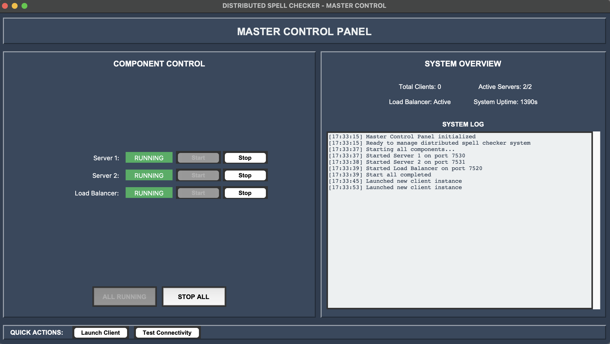
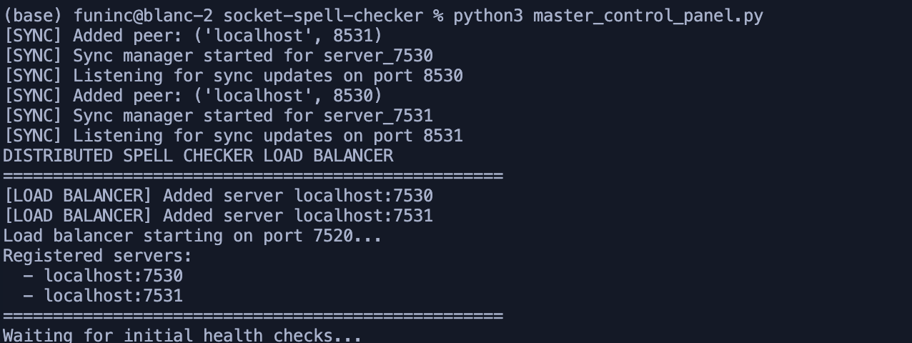
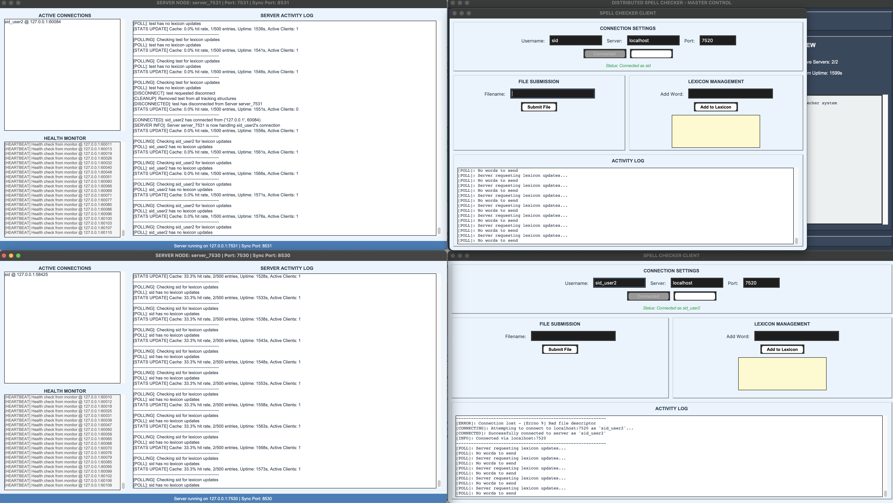
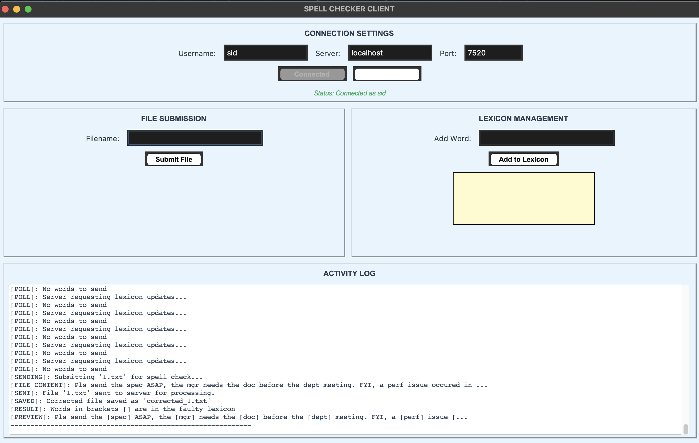
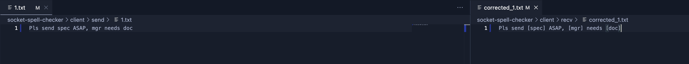
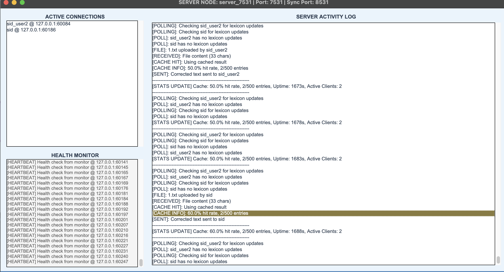
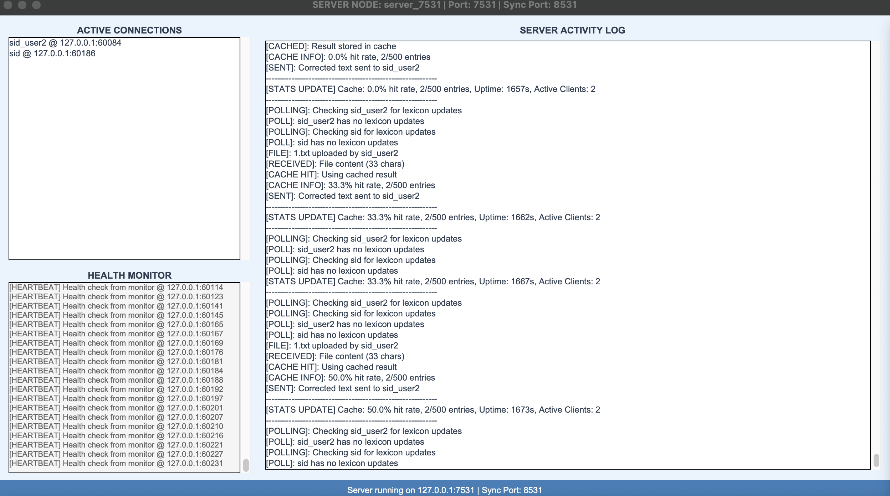
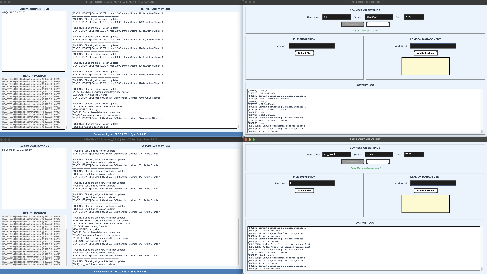

# Distributed Spell Checker System

A fault-tolerant, multi-server spell checking system built with Python socket programming. Checks text files against a lexicon of faulty/informal words and flags them.

## What It Does

The system maintains a lexicon of problematic words (slang, misspellings, informal terms). When you submit a text file, it marks these words with brackets. For example:
- Input: "Can you fw the info ASAP?"
- Output: "Can you [fw] the [info] [ASAP]?"

## Architecture

```
Clients -> Load Balancer (7520) -> Server 1 (7530) -> Server 2 (7531)
                |                         |
                v                         v
        Cache Layer <- Health Monitor <- Sync Manager (8530, 8531)
```

- **Multiple servers** handle spell checking
- **Load balancer** distributes clients between servers  
- **Caching** improves performance for repeated texts
- **Lexicon sync** keeps all servers updated with the same word list

## Screenshots

### System Overview

*Centralized control panel for managing the entire system*


*Load balancer distributing clients across servers*


*Additional system component overview*

### Client Interface

*Client interface for submitting files for spell checking*


*Client file processing workflow*

### Performance & Monitoring

*Cache performance metrics showing 60% hit rate*


*Real-time system health monitoring*


*Load balancing and distribution metrics*

## Quick Start

### Option 1: Use Master Control Panel (Easiest)
```bash
python3 master_control_panel.py
```
Then click "START ALL" and "Launch Client"

### Option 2: Manual Start
```bash
# Terminal 1 - Server 1
python3 server.py --port 7530

# Terminal 2 - Server 2  
python3 server.py --port 7531

# Terminal 3 - Load Balancer
python3 load_balancer.py

# Terminal 4 - Client
python3 client.py
```

### Option 3: Single Server Mode
```bash
python3 server.py
python3 client.py
```

## How to Use

1. **Connect**: Enter username and connect to localhost:7520
2. **Submit File**: Type filename (like "1.txt") and click Submit
3. **Check Results**: Corrected file appears in client/recv/ folder
4. **Add Words**: Add new words to lexicon through Lexicon Management
5. **Wait for Sync**: Servers poll clients every 30 seconds for new words

## Core Components

- `server.py` - Main spell checker server with GUI
- `client.py` - Client application with file management
- `load_balancer.py` - Routes clients between available servers
- `cache_manager.py` - LRU caching system with TTL
- `health_monitor.py` - Server health monitoring
- `sync_manager.py` - Inter-server synchronization
- `master_control_panel.py` - Centralized system control

## Features

- Multi-client support using threading
- GUI interfaces for both client and server
- File-based spell checking with detailed feedback
- Dynamic lexicon updates from any client
- Intelligent caching for improved performance
- Load balancing across multiple servers
- Health monitoring with automatic failover
- Real-time statistics and connection tracking

## Testing

Test system connectivity:
```bash
python3 test_system.py
```

## Performance Features

- **LRU Cache**: 20-40% performance improvement for repeated queries
- **Load Balancing**: Round-robin distribution across servers
- **Health Monitoring**: Automatic failover to healthy servers
- **Vector Clock Sync**: Eventual consistency across distributed servers

## System Requirements

- Python 3.7+
- tkinter (usually included with Python)